# Отчет по ЛР
**Выполнил:** Назаров Кирилл  
**Группа:** ЭВМб-23-1  

## Лабораторная работа 1
**Вариант 6:** Медведь большой. Слон большой. Кот маленький. Медведь коричневый. Кот черный. Слон серый. Любой черный или коричневый предмет является темным.

### Результаты работы
1. Кто одновременно большой и темный:
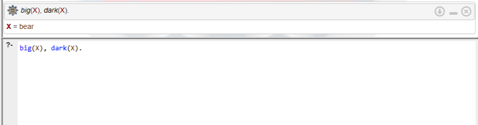

2. Есть ли коричневые маленькие слоны:
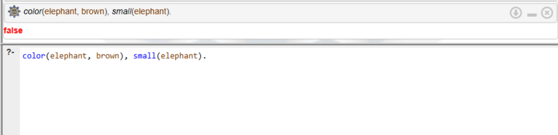

3. Проверка: является ли медведь большим и темным:
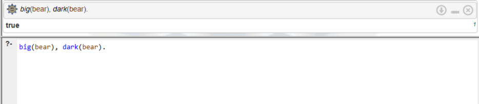

4. Проверка цвета кота:
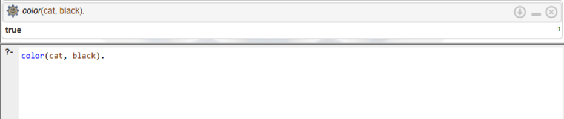

**Вывод:** Изучен базовый синтаксис языка логического программирования Prolog. Освоено использование фактов и правил.

## Лабораторная работа 2
**Вариант 16:** Инвертировать список.

**Декларативная интерпретация:** Инверсия пустого списка - пустой список. Инверсия списка состоит из инвертированного хвоста, к которому в конец прикреплена голова.  
**Процедурная интерпретация:** Программа рекурсивно разделяет список на голову и хвост, инвертирует хвост, а затем с помощью `append` добавляет голову в конец получившегося списка.

### Результаты работы
1. Инвертирование числового списка:
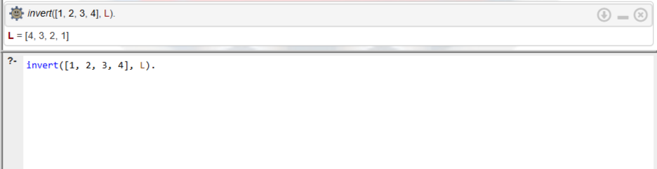

2. Обработка пустого списка:
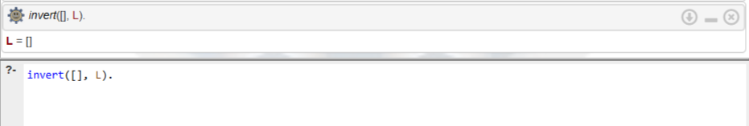

**Вывод:** Разобран механизм обработки списков `[H|T]` и применение рекурсии.

## Лабораторная работа 3
**Вариант 9:** База данных "Видеопрокат".

### Результаты работы
1. Инициализация базы данных:

2. Просмотр списка клиентов:
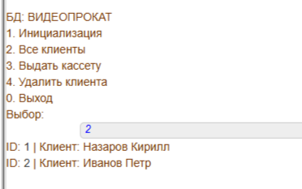

3. Добавление записи о выдаче кассеты:
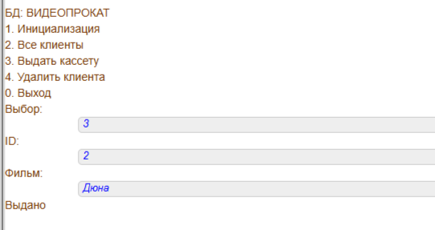

4. Каскадное удаление клиента и его записей:
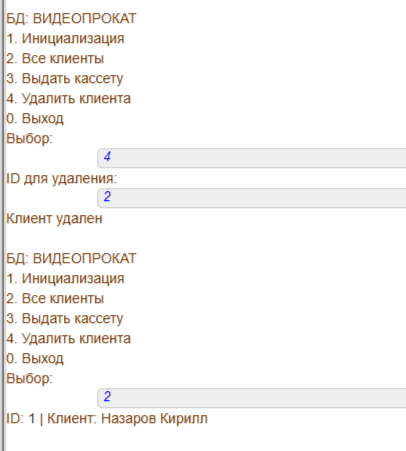

5. Завершение работы:
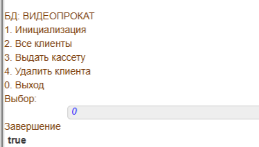

**Вывод:** Опробована работа с динамическими предикатами. Реализовано добавление (`assertz`) и удаление (`retractall`) данных через пользовательское консольное меню.

## Лабораторная работа 4
**Вариант 12:** Решить ребус: БЛОК * 7 = СТЕНА (каждая буква — уникальная цифра).

### Результаты работы
1. Решение ребуса (нахождение цифр для каждой буквы):
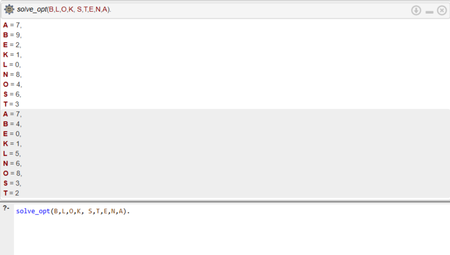

2. Скорость выполнения наивного перебора:
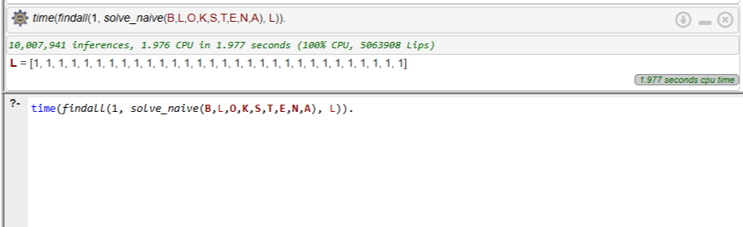

3. Скорость выполнения оптимизированного перебора:
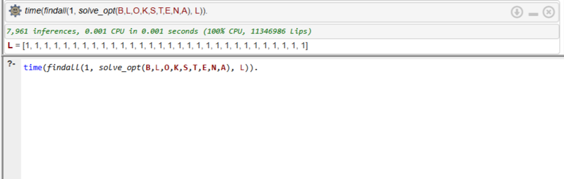

**Вывод:** Использование математических свойств (вычисление остатков от деления и перенос разрядов) позволило отсекать неверные ветви дерева на раннем этапе генерации. Это снизило количество операций (inferences) в тысячи раз по сравнению с методом полного перебора всех возможных перестановок.

## Лабораторная работа 5
**Задание:** Разработать продукционную экспертную систему. Тематика: "Выбор автомобиля".

### Результаты работы
1. Сценарий 1 (Внедорожник + Семья):
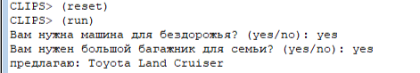

2. Сценарий 2 (Внедорожник + Без семьи):
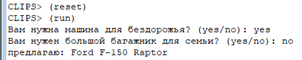

3. Сценарий 3 (Город + Спорт):
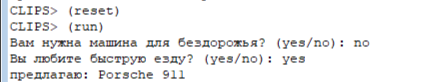

4. Сценарий 4 (Город + Спокойная езда):
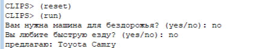

**Вывод:** Изучена среда разработки CLIPS. Написаны продукционные правила `defrule` для организации прямого логического вывода на основе ответов пользователя.
